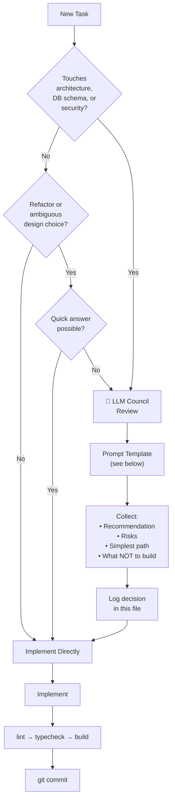

# LLM Council Review Log — NirmiqLearn OS

> Record every architecture, security, and overengineering decision here.
> AI tools should check this log before making similar decisions to avoid re-litigating settled choices.
> Reviews are specific to **this project (NirmiqLearn OS)** only. Do not log decisions for other projects here.

---

## When to Trigger a Council Review



---

## Council Prompt Template

```
Consult LLM Council for a concise MVP-focused review.

Question:
[specific architecture or design decision]

Context:
[2-3 sentences max — what the feature does, what you are deciding between]

Constraints:
- local-first (SQLite, no cloud required in MVP)
- student-buildable
- Next.js 16 App Router + TypeScript strict
- Avoid overengineering
- MVP scope only

Return:
1. Best recommendation for MVP
2. Key risks
3. Simplest implementation path
4. What NOT to build yet
```

---

## When NOT to Use Council

- Simple component styling
- Variable naming
- UI copy
- Adding a route that follows an established pattern
- Tasks Claude can handle alone with confidence

---

## Decision Log

---

### REVIEW-001 — Initial Stack and Architecture Choice

**Date:** 2026-06-04
**Phase:** 0 — Project Initialization
**Decision:** Choose MVP stack and database strategy

**Question Asked:**
What is the simplest stack for a local-first student learning OS that a solo developer can ship in phases, avoid overengineering, and iterate quickly on?

**Council Synthesis:**

**Recommendation:** Next.js App Router + SQLite via Drizzle ORM.

Rationale:
- Next.js App Router enables server components + server actions, removing the need for a separate API layer in MVP
- SQLite is zero-config, ships as a file, and is fast enough for a single local user
- Drizzle ORM is lightweight, type-safe, and generates clean migrations
- Zod handles validation at service boundaries without a full backend framework
- Zustand is appropriate for lightweight UI state (sidebar, theme, workspace selection) — persistent data stays in SQLite only

**Risks:**
- SQLite has no concurrent write support (not a problem for single-user local app)
- Drizzle migrations require manual management (acceptable for MVP)
- If multi-user sync is added later, SQLite must be swapped for Postgres — design services to be DB-agnostic

**Simplest Path:**
- Use `better-sqlite3` (synchronous driver) so service functions can be plain TypeScript without async complexity
- Use Drizzle `generate` + `migrate` commands as npm scripts
- No ORM magic — write explicit queries in services

**What NOT to Build Yet:**
- No Prisma (heavier, wrong abstraction for this stage)
- No Postgres (overkill for local single-user)
- No tRPC (unnecessary indirection when Server Actions work)
- No Redis/external cache
- No vector DB (save for Phase 9+ when local LLM is added)
- No real-time sync

**Status:** ✅ Accepted — implemented in Phase 0

---

### REVIEW-002 — Plug-and-play IDE Integration + Security Model

**Date:** 2026-06-06
**Phase:** Post-MVP Extension Architecture
**Decision:** How to make NirmiqLearn OS plug-and-play for any IDE, and the right security/privacy model for a local-first tool that reads project files.

**Question Asked:**
Should we build a VS Code extension, CLI tool, MCP server, or all three? What is the right security and privacy model for a local-first tool that reads project files?

**Council Synthesis:**

**Recommendation:** MCP server (highest leverage — works in Claude Code, Cursor, Windsurf natively) + CLI launcher (covers JetBrains, Neovim, any shell). Do NOT build a VS Code extension in MVP.

**Risks:**
- `better-sqlite3` requires native compilation — may fail on machines without build tools. Documented in README; `tsx` used to run the MCP server without a separate build step.
- MCP port collision — mitigated by using stdio transport (no network socket opened).
- Content-Disposition header injection — FIXED: `safeFilename()` now strips all non-alphanumeric characters before setting the header.
- `0.0.0.0` binding — FIXED: `--hostname 127.0.0.1` added to both `dev` and `start` scripts.
- Privacy via MCP — documented in Privacy Policy page and Settings.

**Simplest Path:**
1. Fix Content-Disposition injection and localhost binding (security fixes first).
2. Add security headers to `next.config.ts` (CSP, X-Frame-Options, Permissions-Policy).
3. Build MCP server (`mcp-server/index.ts`) with 7 tools backed by the existing service layer.
4. Build CLI (`bin/nirmiq.mjs`) — `start`, `mcp`, `open` commands; auto-adds `data/` to `.gitignore`.
5. Add Privacy Policy page + MCP setup guide in Settings.

**What NOT to Build Yet:**
- VS Code extension (VSIX release pipeline overhead; Cursor/Windsurf already use MCP)
- JetBrains plugin (CLI covers this)
- Cloud sync / auth (anti-product identity)
- Encrypted SQLite (overkill for MVP; document the limitation instead)

**Status:** ✅ Accepted — implemented in security + extension commit

---

### REVIEW-003 — Make GitHub import fully auto-populate the learning experience

**Date:** 2026-06-19
**Phase:** Post-MVP — plug-and-play import companion
**Decision:** When a repo is imported, every learning surface (learning map, DSA bridge, explain-back, overview) must be auto-generated from the repo + metadata. The user must never be required to manually fill content.

**Question Asked:**
After importing a repo, the learning-map and DSA-bridge pages still presented "Add Module / Add Checkpoint / Add Concept" as the primary action, implying manual data entry — the opposite of the product promise ("the app explains the project to you"). What should change?

**Council Synthesis:**

**Recommendation:** Keep the working pipeline and data model. The import already auto-populates (workspace + 10 questions + 5 concepts + learning map). The real gaps were: (a) two workspaces predated the import bug-fixes and were half-empty; (b) the auto-map didn't carry the CS concepts as module tags; (c) the feature pages led with manual-entry forms and empty-state copy that implied manual filling.

**Fix:** clear the stale workspaces; route all analyzer output into the map (section modules + CS-concept chips on the architecture module + understand-area checkpoints + full raw analysis); present auto-generated content first and demote the manual forms into a clearly separated, collapsed "Add your own" section; make empty-state copy point to import, not manual entry.

**Risks:**
- Re-import loses manual edits on stale workspaces — negligible, they were empty; deleted with confirmation.
- GitHub clone path less-tested than local path — mitigated by an end-to-end clone→analyze→populate verification.
- Over-stuffing the map — mitigated by capping concept chips and keeping summaries short.

**Simplest Path:**
1. Verify GitHub-URL import end-to-end on a small public repo.
2. Delete the two stale workspaces (with confirmation).
3. Enrich `buildLearningMapContent` — attach parsed CS concept names to the architecture module.
4. Learning-map & DSA-bridge pages: content-first; manual forms moved into a separate collapsed "Add your own" section; import-aware empty states.
5. Ship clean: lint → typecheck → build → manual re-import check.

**What NOT to Build Yet:**
- No per-file deep / AST analysis — section-based analysis is enough for MVP.
- No new DB tables or schema changes — everything needed is already stored.
- No AI requirement — the local analyzer must keep populating everything with no API key.

**Manual forms — explicitly KEPT (do not remove, do not rebuild):**
The "Add Module", "Add Checkpoint", and "Link a Concept" forms stay in the product. They are NOT removed and the editor is NOT rebuilt — they are simply demoted into a separate, collapsed "Add your own" section so users can still add their own notes on top of the auto-generated content. Auto-generation is the default; manual entry is the optional supplement.

**Status:** ✅ Accepted — implemented (import enrichment + content-first UI + stale-workspace cleanup)

---

## Architecture Decisions Summary

| ID | Decision | Outcome | Phase |
|----|----------|---------|-------|
| REVIEW-001 | Stack: Next.js + SQLite + Drizzle | ✅ Accepted | 0 |
| REVIEW-002 | MCP server + CLI; no VS Code extension; security hardening | ✅ Accepted | Post-MVP |
| REVIEW-003 | Import auto-populates all surfaces; content-first UI; manual forms kept but collapsed | ✅ Accepted | Post-MVP |
